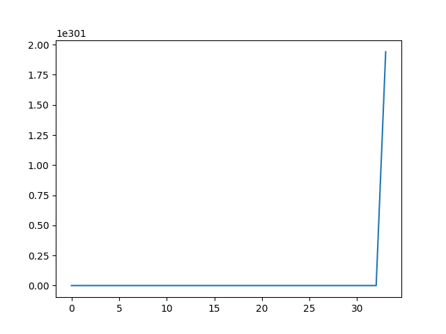
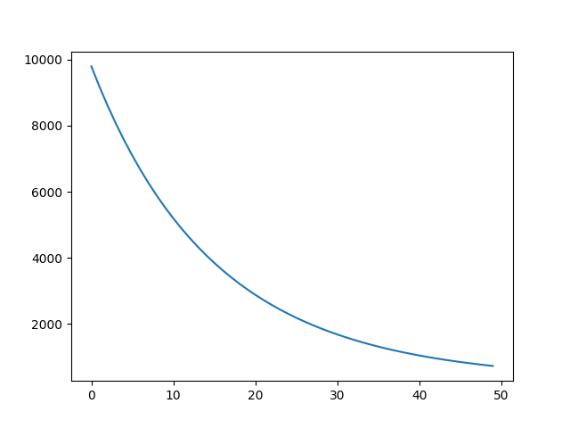
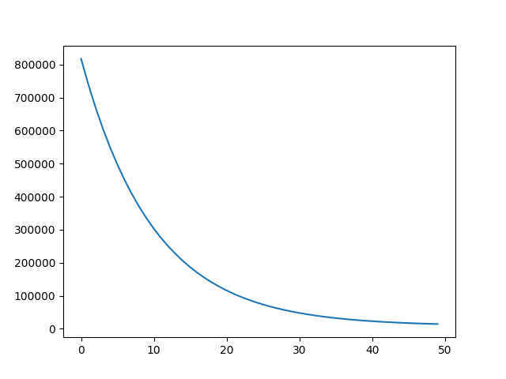

## Task 1

Step sizes 0.1 and 0.01 overshoot the minimum and don't find anything.
Step size 0.001 returns point `[0.99117313, 0.98238866]`

Execution time for step size 0.001 is 0.07433104515075684 seconds

Program needs more than 10000 iterations to reach desired accuracy

(first few iterations are cut off for better scale)

Step sizes 0.1 and 0.01 don't converge

## Task 2

Step size 0.1:

Execution time is 0.0011522769927978516 seconds

Step size L1:

Execution time is 0.0010976791381835938 seconds

Step size L2 for ||x|| < 20:

Execution time is 0.0009999275207519531 seconds

L2 <= 49452
I chose L2 = 400

## Task 3

Approximate intersections are at x values 0 and 1.1

Function g1(x) (blue) and its derivative (orange)

L1 = 0.62 chosen to be larger than derivative on interval [0, 2]

Function g2(x) (blue) and its derivative (orange)

L2 = 0.49 chosen to be larger than derivative on interval [0, 2]

Gradient descent for g1 (blue) returns point 0.08823, not reaching desired accuracy in 100 iterations.
Gradient descent for g2 (orange) returns point 1.14619 in only a few iterations.

The convergence rate for g2 is much larger than for g1 because g2 has a steep derivative around its minimum. 
G1's derivative around its minimum approaches zero, so the convergence rate is very slow.
It is still converging to zero, as shown by its x values at 10*i iterations decreasing:
`2.00000,
0.32490,
0.21830,
0.17312,
0.14704,
0.12967,
0.11708,
0.10745,
0.09978,
0.09350,
0.08823`

